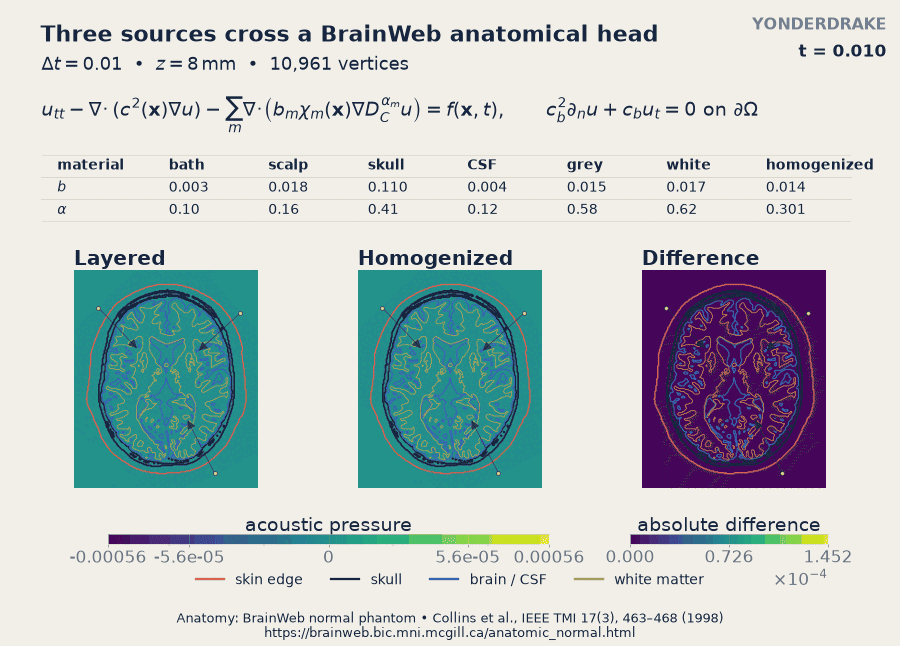
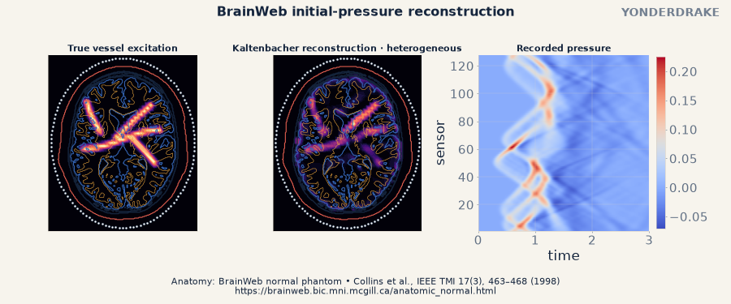
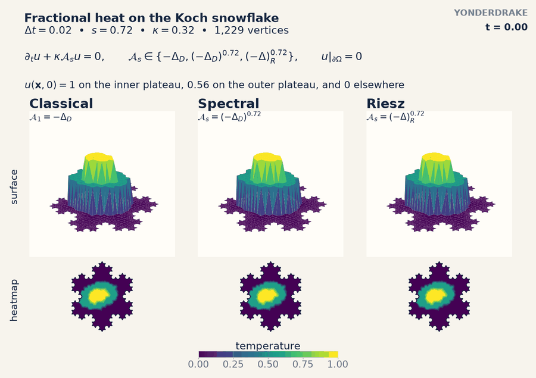

<p align="center">

</p>

<h1 align="center">Yonderdrake</h1>

<p align="center">
  Fractional in time, space and other nonlocal operators for
  <a href="https://www.firedrakeproject.org/">Firedrake</a>
</p>

<p align="center">
  <a href="https://github.com/TSGut/yonderdrake/actions/workflows/ci.yml"></a>
  <a href="https://timon.gutleb.com/yonderdrake/"></a>
  <a href="https://pypi.org/project/yonderdrake/"></a>
  <a href="https://doi.org/10.5281/zenodo.21782150"></a>
  <a href="https://github.com/TSGut/yonderdrake/blob/main/LICENSE"></a>
</p>

> **Alpha software:** Yonderdrake has been broadly tested, but bugs and missing
> features may remain. Please [report them as issues](https://github.com/TSGut/yonderdrake/issues).

Yonderdrake adds various fractional time derivatives, fading-memory operators,
and spatial fractional Laplacians directly to
[UFL](https://docs.fenicsproject.org/ufl/main/) forms solved with
[Firedrake](https://www.firedrakeproject.org/). Time- and space-nonlocal
operators can also be combined in the same equation.

The eventual goal is to gather all FEM-compatible methods for fractional differential
equations in one place, so that comparing or switching between them does not
mean rebuilding the problem each time.

## Features

- Caputo and initialized Riemann-Liouville fractional-in-time derivatives with various methods including static memory diffusive representations, full-history stepping along with additional implementations from the literature for easy comparisons.
- General single-timescale exponential memory operators, including a convenience wrapper for the Caputo-Fabrizio operator.
- Homogeneous-Dirichlet spectral, zero-exterior Riesz, and periodic Fourier
  fractional Laplacians.
- 2D and 3D Caputo-Wismer waves with heterogeneous density, driven sources,
  impedance boundaries, PML, configurable sensor arrays, exact adjoints, time
  reversal, and regularized reconstruction.
- Variable timesteps, PETSc solver configuration, MPI execution, and checkpoint/restart.
- Compatibility with [Irksome](https://www.firedrakeproject.org/Irksome/index.html) for classical time stepping alongside Yonderdrake operators.

## Examples

The demo scripts live in this repository rather than the installed package, so
clone it to run them yourself.

### Fractional time

Three sources in a BrainWeb anatomical head with material-dependent
Caputo-Wismer damping:

<p align="center">
  
</p>

Recovering a vessel-shaped initial pressure from measurements around a
realistic head. The first two panels compare the true source with its
reconstruction. The third shows the pressure recorded by the sensor
array:

<p align="center">
  
</p>

### Fractional space

Classical, spectral-fractional, and Riesz heat flow on a Koch snowflake:

<p align="center">
  
</p>

See the [guides and examples](https://timon.gutleb.com/yonderdrake/#guides-and-examples)
for small, reproducible problems and the
[demo gallery](https://timon.gutleb.com/yonderdrake/gallery/index.html) for the
full applications.

## Installation

Create a [Firedrake environment](https://www.firedrakeproject.org/install.html),
then install into it:

```console
python -m pip install yonderdrake
```

Add the plotting dependencies to run the gallery demos or regenerate their
media:

```console
python -m pip install 'yonderdrake[visual]'
```

Firedrake supplies MPI and PETSc. See
[supported platforms](https://timon.gutleb.com/yonderdrake/support.html).

## Documentation

Start with the [quickstart](https://timon.gutleb.com/yonderdrake/quickstart.html),
then the [guides and examples](https://timon.gutleb.com/yonderdrake/#guides-and-examples).
The [mathematics and methods](https://timon.gutleb.com/yonderdrake/#mathematics-and-methods)
summarize the supported algorithms and the papers behind them. The
[API reference](https://timon.gutleb.com/yonderdrake/api.html) gives exact
signatures and restrictions.

## Contributing

See [CONTRIBUTING.md](CONTRIBUTING.md) for what a numerical change should
include. LLM-assisted contributions are welcome in principle and are held to
the same standards as all others. The human author remains responsible for the
code they submit.

## Logo

The logo nods to the *long memory* of time-fractional operators: a fractional
derivative still feels the entire history that preceded it. The
logo dragon is inspired by the
[Lindwurmbrunnen](https://www.atlasobscura.com/places/lindwurmbrunnen) in Klagenfurt, Austria, drawn in a viridis-like colour scheme.
