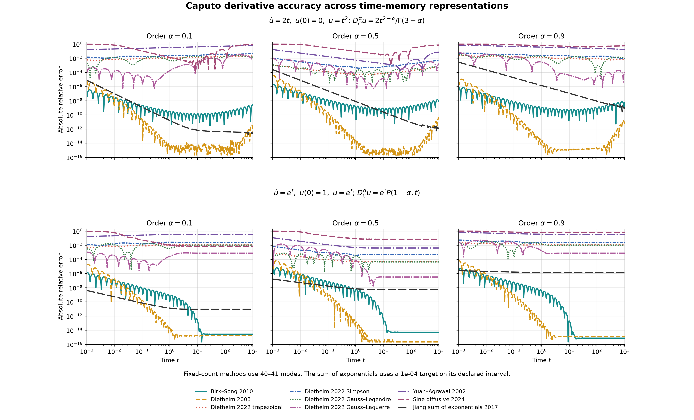
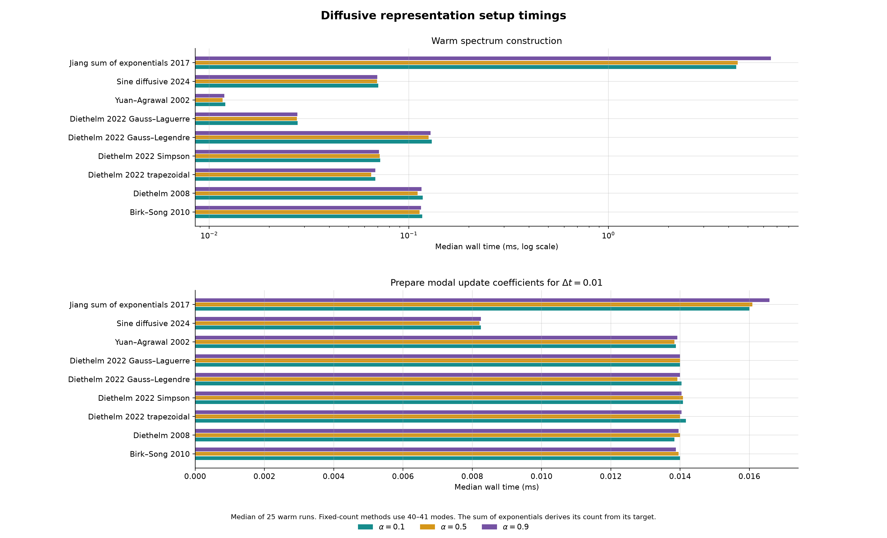
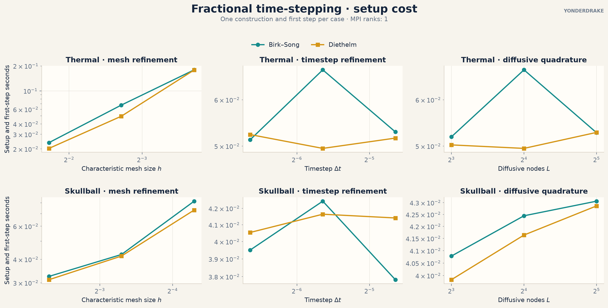
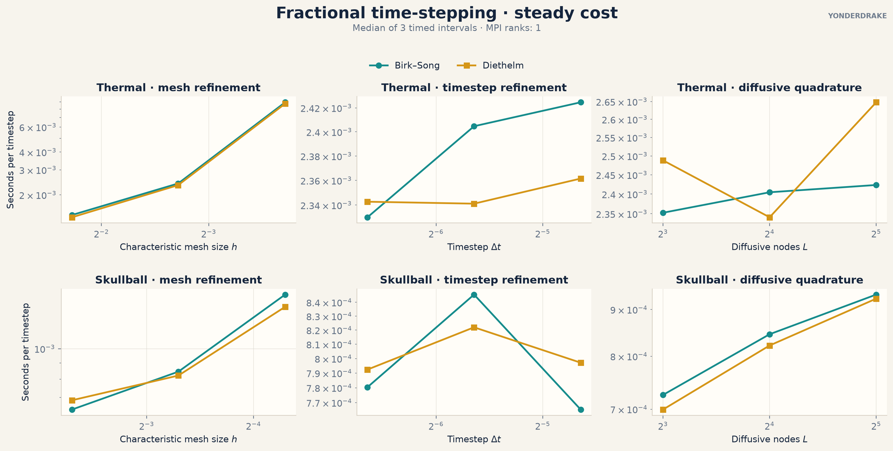

# Accuracy and performance

These comparisons show how the numerical controls affect accuracy, setup
cost, repeated work, and storage. Absolute timings depend on the machine,
mesh, solver configuration, and MPI layout. The trends are the useful part.

The [benchmark sources and recorded CSV data](https://github.com/TSGut/yonderdrake/tree/main/benchmarks)
are available for reproducing the figures or making a comparison on different
hardware.

| Question | Measurement | Practical consequence |
| --- | --- | --- |
| How many memory modes are enough? | Error against analytic fractional derivatives with no timestep or PDE error | Increase $L$ until the quantity of interest stops changing, then refine the timestep |
| What controls time-stepping cost? | Setup and steady cost while varying $h$, $\Delta t$, and $L$ separately | Mesh size controls each solve, $L$ controls memory work and storage, and $\Delta t$ controls how many solves are needed |
| How accurate are the spatial numerical controls? | Error against an analytic spectral power or an over-resolved Riesz action | Tighten the operator control until its error is below the mesh error |
| What is paid once and what is paid repeatedly? | First application and cached application timings | Setup matters for short jobs, while repeated cost matters for long integrations and inverse problems |
| Which Riesz backend fits the problem? | Construction, application, storage, and agreement with dense assembly | Matrix-free avoids storage, H-matrices trade compression error and setup for faster reuse, and dense assembly is a small-problem reference |

(time-derivative-representation-benchmarks)=
## Time-memory representations

The first comparison applies every supported and comparison-only time-memory
representation to the same two analytic functions over six decades of time.
The fixed-count methods use 40 or 41 modes to respect the even-count
Gauss-Laguerre and odd-count Simpson rules. `SumOfExponentials` derives its mode
count from a $10^{-4}$ kernel target on the declared interval. Its newest
interval uses the same linear-interpolant correction as the time stepper, with
`min_step=1e-5`. The fixed-count modes are evaluated analytically. The curves
therefore measure the standalone derivative approximation without a PDE mesh
or linear solver.

<div class="doc-figure-grid">
  <figure>
    <a href="../_static/benchmarks/diffusive-representation-errors.png">
      
    </a>
    <figcaption>The fixed-count methods use 40 or 41 modes. The sum of exponentials
    uses the mode count selected by its requested tolerance and interval.</figcaption>
  </figure>
  <figure>
    <a href="../_static/benchmarks/diffusive-representation-timings.png">
      
    </a>
    <figcaption>Spectrum construction is a small setup cost. Preparing the
    recurrence coefficients is cheaper still. The sum of exponentials includes
    the cost of deriving its tolerance-controlled spectrum.</figcaption>
  </figure>
</div>

`BirkSong` is the default. `Diethelm2008` and `SumOfExponentials` are supported
alternatives. `Diethelm2022`, `YuanAgrawal`, and `SineDiffusive` are
literature-comparison options. The large differences in their curves come from
the placement and scaling of the modes over the problem's time range. Mode
count alone does not determine accuracy.

`SineDiffusive` uses exact undamped rotations. The other rows use a decaying
first-order update. Its slow mode refinement and persistent long-time error
are visible in the results.

### Accuracy at matched computational cost

Equal mode counts are close to equal cost for the positive-rate methods
because they use the same static-memory recurrence. The sine representation
stores and advances two states per frequency. The cost-matched comparison
therefore calibrates each fixed-count method against the same measured
workload.

The reference budget is the mean time for 41-mode Birk-Song and Diethelm. A
workload includes spectrum setup and 512 static-memory updates over 256 scalar
field values at each of the three fractional orders. Each fixed-count method
uses the valid total mode count with the nearest median runtime. For
`SumOfExponentials`, the requested tolerance is selected from a logarithmic
sequence and its derived spectrum is timed in the same workload. The legend
reports every selected count and measured cost ratio.

This comparison uses $0.1\leq t\leq10$. Over that representative interval the
derived sum-of-exponentials spectrum fits the same moderate work budget, while
Birk-Song and Diethelm remain above floating-point saturation for enough of the
range to compare errors above the machine-precision plateau.

```{figure} ../_static/benchmarks/diffusive-representation-cost-matched.png
:alt: Caputo representation errors with mode counts selected for matched computational cost
:class: doc-figure
:target: ../_static/benchmarks/diffusive-representation-cost-matched.png

Representation error for two analytic Caputo derivatives at the same measured
memory-work budget.
```

The fixed-count error curves use exact auxiliary-mode evolution. The sum of
exponentials includes its required newest-interval correction. The comparison
isolates the accuracy bought by the representation-controlled work without a
mesh, solver, or PDE error. A full PDE also pays for its common linear solve,
so differences in total application runtime will be smaller.

### Accuracy across time-memory families

The representation comparison above isolates spectrum error. The end-to-end
comparison below measures actual
Firedrake solves for the manufactured solutions $u(t)=t^2$ and
$u(t)=t^\alpha$, including construction, history updates, and linear solves.
The reference budget is the mean wall time of fixed 100-mode Birk-Song and
Diethelm 2008 runs. Each run advances 500 timesteps with $\Delta t=0.001$ over
$0 \leq t \leq 0.5$. Every other family uses the same time grid and is tuned
only within 0.5 to 2 times that measured budget. The candidate with the
smaller worst error is then retained. The two reference methods themselves
remain fixed at 100 modes.

The benchmark varies mode count and scale for fixed spectra, tolerance for the
sum of exponentials, order and starting corrections for Lubich CQ, and contour
size and direct window for fast-oblivious CQ. The timestep and physical interval
remain fixed. These timings cover the complete time-memory method. The earlier
figure covers quadrature alone.

```{figure} ../_static/benchmarks/time-memory-family-cost-matched.png
:alt: Smooth and weakly singular errors, actual runtime, and field storage for all time-memory families at matched cost
:class: doc-figure
:target: ../_static/benchmarks/time-memory-family-cost-matched.png

Accuracy, measured end-to-end cost, and peak distributed-field storage for
the selected method configurations. The CSV records every selected parameter,
runtime ratio, error, and asymptotic work and storage class.
```

### Convergence with mode count

The Diethelm 2008 refinement study holds the time treatment fixed and increases
only the number of Gauss-Jacobi nodes. More nodes extend the interval over
which the representation remains accurate and lower the error until
floating-point precision becomes visible.

```{figure} ../_static/benchmarks/diethelm2008-node-refinement-errors.png
:alt: Diethelm 2008 representation error as the number of modes increases
:class: doc-figure
:target: ../_static/benchmarks/diethelm2008-node-refinement-errors.png

Diethelm 2008 node refinement for polynomial and exponential inputs at three
fractional orders. Each curve contains representation error only.
```

For an application, first increase $L$ at fixed $\Delta t$. Once that result
is stable, reduce $\Delta t$ to measure the separate time-discretization
error. The {doc}`refining workflow <refining>` gives the corresponding
sequence for every operator family.

### Tolerance-driven exponential sums

`SumOfExponentials` appears in the shared comparisons with a mode count derived
from its requested interval and tolerance. The study below isolates that
control by tightening the absolute kernel target on a fixed interval and
recording the verified error, derived storage, and construction cost.

```{figure} ../_static/benchmarks/sum-of-exponentials-refinement.png
:alt: Jiang sum-of-exponentials error, mode count, and construction time
:class: doc-figure
:target: ../_static/benchmarks/sum-of-exponentials-refinement.png

Tighter kernel tolerances derive more modes. The verified error remains below
the requested target for each tested fractional order.
```

## Fractional time stepping

The application study uses two different PDEs. The thermal problem is a
moving heat source on a torus. The Caputo-Wismer problem is a wave travelling
through a layered skull geometry with an absorbing exterior boundary. Each
study changes the mesh size $h$, timestep $\Delta t$, or number of diffusive
nodes $L$ while holding the other two fixed.

<div class="doc-figure-grid">
  <figure>
    <a href="../_static/benchmarks/time-fractional-scaling-setup.png">
      
    </a>
    <figcaption>Construction and the first step grow mainly with the physical
    problem size. Birk-Song and Diethelm have similar setup costs in these
    applications.</figcaption>
  </figure>
  <figure>
    <a href="../_static/benchmarks/time-fractional-scaling-steady.png">
      
    </a>
    <figcaption>Mesh refinement raises the cost of each step. Increasing $L$
    adds memory work, while changing $\Delta t$ has no systematic effect on
    the cost of one step.</figcaption>
  </figure>
</div>

The timestep still has a direct effect on total runtime. Halving $\Delta t$
approximately doubles the number of steps needed to cover the same physical
duration, even when the cost of each step is unchanged.

For a field with $N$ degrees of freedom and one fractional term, static
memory stores $LN$ mode values. Doubling $L$ therefore doubles that memory
state. Multiple fractional terms contribute their own mode fields. See
{doc}`../performance` for the storage requirements of the other formulations
and spatial operators.

## Spatial fractional operators

The spatial results separate three effects that should be refined
independently:

1. the finite-element mesh
2. the internal approximation used to apply the nonlocal operator
3. the algebraic solver tolerance.

The figures below vary the first two. Solver tolerances are kept below the
measured numerical error.

### Accuracy of the internal controls

For the spectral operator, the sinc truncation target controls the number of
shifted elliptic solves. Tightening it reduces the error against a known
fractional eigenvalue power. For the Riesz operator, increasing the target
quadrature degree reduces the error against an over-resolved Galerkin action.

```{figure} ../_static/benchmarks/spatial-operator-accuracy.png
:alt: Accuracy under spectral sinc-target and Riesz quadrature refinement
:class: doc-figure
:target: ../_static/benchmarks/spatial-operator-accuracy.png

Numerical-control error on fixed meshes. These curves do not include a mesh
refinement study.
```

The seven-point spectral sequence behaves like an accuracy request in this
test, with the observed error falling as the requested target is tightened.
Riesz target quadrature is shown at six degrees. It converges more gradually
and becomes increasingly expensive. In both cases, further refinement is
useful only while this error is large enough to affect the final solution.

The periodic Fourier operator has no quadrature control. Its accuracy is set
by the resolution of the uniform periodic grid, and its action uses a
distributed FFT. Refining that grid increases both the resolved wavenumber
range and the FFT work.

### Mesh and operator scaling

The scaling comparison uses the irregular-island geometry and population
field from the habitat example. The mesh panel compares repeated spectral and
matrix-free Riesz actions at six mesh resolutions. The other panels hold the
mesh fixed and use six values of each operator-specific numerical control.

```{figure} ../_static/benchmarks/spatial-operator-scaling.png
:alt: Spectral and Riesz fractional spatial operator scaling
:class: doc-figure
:target: ../_static/benchmarks/spatial-operator-scaling.png

Setup and repeated-application costs for the spectral and matrix-free Riesz
operators. The absolute values are serial timings for these particular small
problems.
```

The spectral operator pays for shifted elliptic solvers during setup and then
reuses them. A tighter sinc target adds shifts, so setup grows more strongly
than a cached application. The Riesz action evaluates a nonlocal integral, so
both mesh refinement and higher target quadrature increase repeated work
substantially. Across the six plotted meshes, its measured application time
rises from 1.9 seconds at 25 degrees of freedom to 73.8 seconds at 121 degrees
of freedom. These operators define different boundary and exterior problems,
so the timing comparison is useful after the required mathematical realization
has been chosen.

### Riesz storage and reuse

The three Riesz backends apply the same Galerkin operator with different
storage and reuse strategies.

| Backend | Construction and storage | Repeated application | Intended use |
| --- | --- | --- | --- |
| Matrix-free | No dense nonlocal matrix | Recomputes the integral action | General use and problems where dense storage is unacceptable |
| H-matrix | Builds dense near blocks and compressed far blocks | Reuses the compressed representation | Repeated applications and larger problems where setup can be amortized |
| Dense | Builds and stores all weak entries | Very cheap after assembly | Reference calculations on small problems |

```{figure} ../_static/benchmarks/riesz-backend-comparison.png
:alt: Riesz backend timing, accuracy, and storage comparison
:class: doc-figure
:target: ../_static/benchmarks/riesz-backend-comparison.png

Application time, construction time, agreement with dense assembly, and
hierarchical storage at seven separated-patch problem sizes.
```

Matrix-free agrees with dense assembly to floating-point precision in this
study. The H-matrix error follows from compression and remains below
$10^{-5}$ for the tested tolerance. Its construction is cheaper than dense
assembly and its repeated action is much cheaper than recomputing the
matrix-free integral. The crossover depends on problem geometry, tolerance,
mesh size, and how often the operator is applied.
